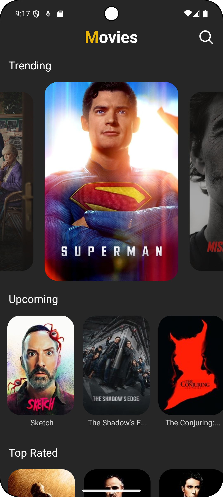

# MovieMate – Your Personal Movie Information Companion

A React Native-based mobile app designed to provide comprehensive movie information, trending films, and detailed cast information.

## Features

- 🎬 Real-time trending movies with current popular films
- 🆕 Upcoming movie releases and previews
- ⭐ Top-rated movies of all time
- 🔍 Global movie search functionality
- 📱 Detailed movie information (plot, cast list, release year, runtime, genres)
- 👥 Comprehensive cast details with individual actor profiles
- 🎭 Actor biography, filmography, and personal details
- 🎬 Similar movie recommendations

## Screenshots

### Home Screen


### Search Screen


### Movie Details Screen


### Actor Profile Screen


## Tech Stack

- **React Native CLI** - Cross-platform mobile development
- **NativeWind (Tailwind CSS)** - Styling and responsive design
- **Axios** - HTTP client for API requests
- **React Navigation** - Navigation and routing
- **Lodash** - Utility functions (debounce)
- **React Native Safe Area Context** - Safe area handling

## Installation

### Prerequisites

Make sure you have completed the [React Native - Environment Setup](https://reactnative.dev/docs/getting-started-without-a-framework) instructions.

### Step 1: Clone the Repository

```bash
git clone https://github.com/Hardik0602/Movie-Mate.git
cd Movie-Mate
```

### Step 2: Install Dependencies

```bash
npm install
# or
yarn install
```

### Step 3: Setup NativeWind (Tailwind CSS)

Follow the [NativeWind installation guide](https://v2.nativewind.dev/getting-started/installation) or this [detailed tutorial](https://blog.logrocket.com/getting-started-nativewind-tailwind-react-native/).

### Step 4: Install iOS Dependencies (iOS only)

```bash
cd ios && pod install && cd ..
```

### Step 5: Configure TMDB API

1. Sign up at [The Movie Database (TMDB)](https://www.themoviedb.org/)
2. Get your API key from your account settings
3. Replace the API key in `Api.js`:
   ```javascript
   const API_KEY = 'your_tmdb_api_key_here'
   ```

### Step 6: DNS Configuration (Recommended)

To avoid ISP-related issues with TMDB API requests, set your device's Private DNS to `dns.google` in your device settings.

## Running the App

### For Android

```bash
npx react-native run-android
```

### For iOS

```bash
npx react-native run-ios
```

## Dependencies

```json
{
  "@react-navigation/native": "^7.1.17",
  "@react-navigation/native-stack": "^7.3.25",
  "axios": "^1.11.0",
  "lodash": "^4.17.21",
  "nativewind": "^2.0.11",
  "react-native-heroicons": "^4.0.0",
  "react-native-linear-gradient": "^2.8.3",
  "react-native-progress": "^5.0.1",
  "react-native-safe-area-context": "^5.6.0",
  "react-native-screens": "^4.13.1",
  "react-native-snap-carousel": "^3.9.1",
  "react-native-svg": "^15.12.1",
  "tailwindcss": "^3.3.2"
}
```

## API Integration

The app uses [The Movie Database (TMDB) API](https://www.themoviedb.org/) for movie data:

- **Trending Movies**: Get currently trending movies
- **Upcoming Movies**: Fetch upcoming movie releases
- **Top Rated Movies**: Access highest-rated films
- **Movie Search**: Search for movies worldwide
- **Movie Details**: Detailed information about specific movies
- **Cast & Crew**: Complete cast information
- **Person Details**: Individual actor/cast member profiles and filmography
- **Similar Movies**: Movie recommendations based on selected films

## Assets & Resources

- **Icons**: [React Native Heroicons](https://github.com/ecklf/react-native-heroicons)
- **Images**: Movie posters and images from TMDB API and [Freepik](https://www.freepik.com)

## Key Features Implementation

### Movie Discovery
- Trending movies updated in real-time
- Upcoming releases with movie previews
- Top-rated movies for quality recommendations

### Movie Details
- Comprehensive movie information including plot, cast list, and release year
- Movie runtime, status, and genre classifications

### Cast & Crew Information
- Individual actor/cast member profile pages
- Popularity ratings and career information

### Similar Movies
- Intelligent movie recommendations based on selected films
- Discover related movies and expand viewing options

### Search Functionality
- Debounced search using Lodash for better performance
- Global movie database search

### UI/UX
- NativeWind (Tailwind CSS) for styling
- Safe area handling with `react-native-safe-area-context`
- Loading states with `react-native-progress`
- Smooth navigation with React Navigation
- Carousel components for movie browsing